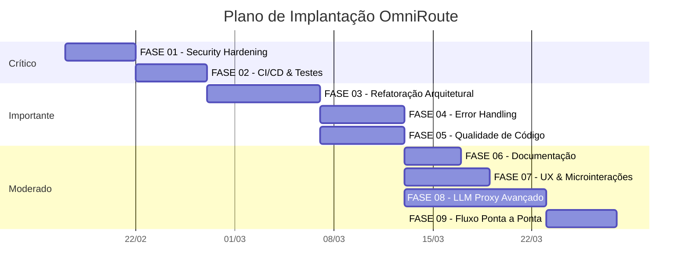
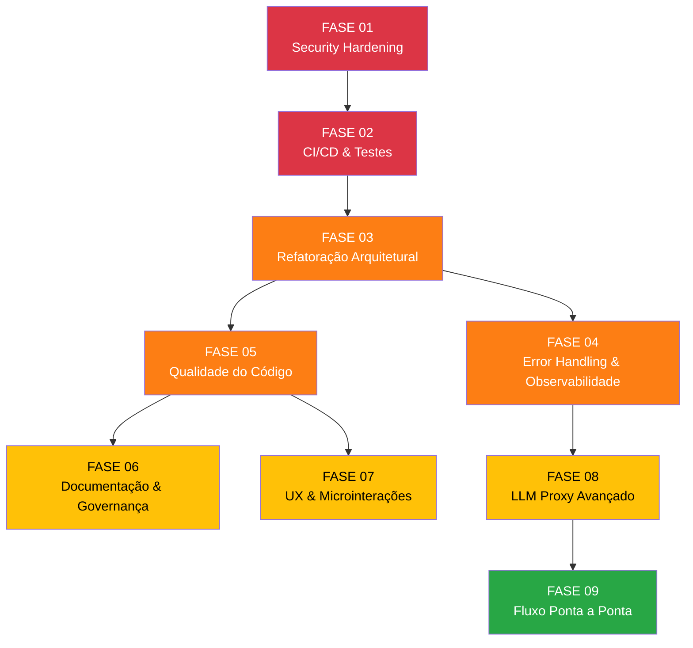

# Plano de Implantação — OmniRoute

> **Versão:** 1.0  
> **Data:** 2026-02-14  
> **Baseado em:** Relatório de Análise Crítica Exaustiva (9 Dimensões)  
> **Total de Fases:** 9  
> **Total de Itens:** 41  
> **Estimativa Total:** 34–59 dias úteis

---

## Visão Geral

---

## Documentos de Fase

| Fase | Documento                                                                                                                            | Prioridade       | Itens | Complexidade |
| ---- | ------------------------------------------------------------------------------------------------------------------------------------ | ---------------- | ----- | ------------ |
| 01   | [FASE-01-security-hardening.md](file:///home/diegosouzapw/dev/proxys/9router/docs/FASE-01-security-hardening.md)                     | 🔴 Crítica       | 5     | Média (3–5d) |
| 02   | [FASE-02-cicd-test-infrastructure.md](file:///home/diegosouzapw/dev/proxys/9router/docs/FASE-02-cicd-test-infrastructure.md)         | 🔴 Crítica       | 5     | Média (3–5d) |
| 03   | [FASE-03-architecture-refactoring.md](file:///home/diegosouzapw/dev/proxys/9router/docs/FASE-03-architecture-refactoring.md)         | 🟠 Importante    | 5     | Alta (5–8d)  |
| 04   | [FASE-04-error-handling-observability.md](file:///home/diegosouzapw/dev/proxys/9router/docs/FASE-04-error-handling-observability.md) | 🟠 Importante    | 5     | Média (4–6d) |
| 05   | [FASE-05-code-quality-standards.md](file:///home/diegosouzapw/dev/proxys/9router/docs/FASE-05-code-quality-standards.md)             | 🟠/🟡 Importante | 4     | Média (4–6d) |
| 06   | [FASE-06-documentation-governance.md](file:///home/diegosouzapw/dev/proxys/9router/docs/FASE-06-documentation-governance.md)         | 🟡 Moderado      | 4     | Baixa (2–4d) |
| 07   | [FASE-07-ux-microinteractions.md](file:///home/diegosouzapw/dev/proxys/9router/docs/FASE-07-ux-microinteractions.md)                 | 🟡 Moderado      | 6     | Média (4–6d) |
| 08   | [FASE-08-llm-proxy-advanced.md](file:///home/diegosouzapw/dev/proxys/9router/docs/FASE-08-llm-proxy-advanced.md)                     | 🟡 Moderado      | 4     | Alta (6–10d) |
| 09   | [FASE-09-e2e-flow-hardening.md](file:///home/diegosouzapw/dev/proxys/9router/docs/FASE-09-e2e-flow-hardening.md)                     | 🟡/🟢 Moderado   | 3     | Média (3–5d) |

---

## Ordem de Execução e Dependências

### Paralelização Possível

| Janela       | Fases Paralelas   | Condição                         |
| ------------ | ----------------- | -------------------------------- |
| Após FASE-03 | FASE-04 + FASE-05 | Ambas dependem apenas de FASE-03 |
| Após FASE-05 | FASE-06 + FASE-07 | Ambas dependem apenas de FASE-05 |

---

## Marcos de Entrega

| Marco                        | Fases Inclusas | Data Estimada | Critério de Aceite                                      |
| ---------------------------- | -------------- | ------------- | ------------------------------------------------------- |
| **M1 — Segurança Baseline**  | FASE-01        | Semana 1      | Segredos obrigatórios, erros logados, sanitizador ativo |
| **M2 — Qualidade Garantida** | FASE-01, 02    | Semana 2      | CI verde, testes executam, cobertura mensurável         |
| **M3 — Arquitetura Madura**  | FASE-01–03     | Semana 4      | Monólitos decompostos, domain layer criado              |
| **M4 — Produção-Ready**      | FASE-01–05     | Semana 6      | Error handling, logging, tipagem padronizados           |
| **M5 — Documentado**         | FASE-01–06     | Semana 7      | ADRs, CONTRIBUTING, SECURITY completos                  |
| **M6 — UX Polish**           | FASE-01–07     | Semana 9      | Toasts, a11y, breadcrumbs, empty states                 |
| **M7 — Gateway Completo**    | FASE-01–09     | Semana 12     | Policy engine, cache, evals, telemetria                 |

---

## Critérios de Qualidade Transversais

Aplicáveis a TODAS as fases:

- [ ] CI pipeline verde após cada merge.
- [ ] Cobertura de testes não regride.
- [ ] Nenhum `console.log` adicionado (a partir da FASE-05).
- [ ] PR review obrigatório.
- [ ] CHANGELOG atualizado a cada fase.

---

## Documentos de Referência

- [Relatório de Análise Crítica](file:///home/diegosouzapw/.gemini/antigravity/brain/4c7323de-ade6-432d-8710-4a71eb43d1ad/omniroute_analysis_report.md)
- [TASKS.md — Lista Completa de Tarefas](file:///home/diegosouzapw/dev/proxys/9router/docs/TASKS.md)
- [ARCHITECTURE.md](file:///home/diegosouzapw/dev/proxys/9router/docs/ARCHITECTURE.md)
- [CODEBASE_DOCUMENTATION.md](file:///home/diegosouzapw/dev/proxys/9router/docs/CODEBASE_DOCUMENTATION.md)
